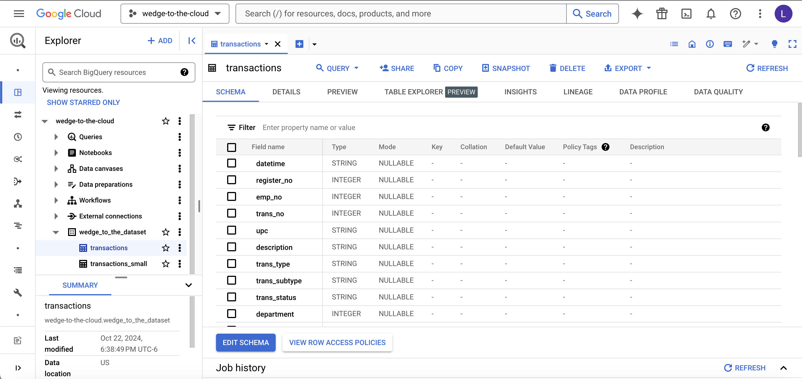
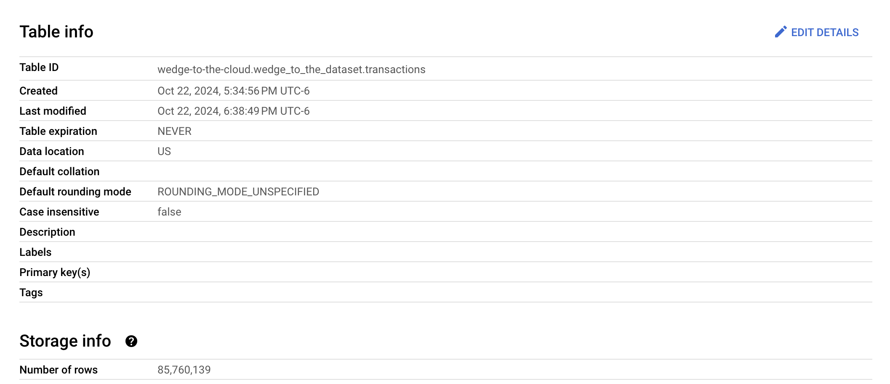
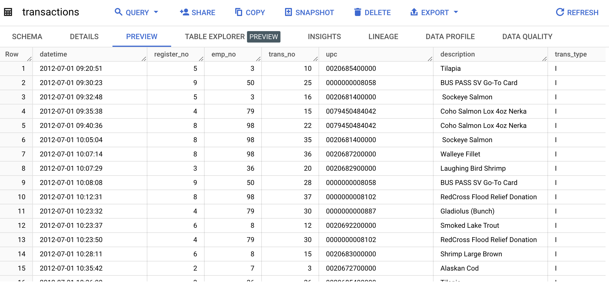

# Applied Data Analytics
## Wedge Project
This project offers hands-on experience in data engineering, focusing on transforming raw transactional data into a structured format for analysis. Data preparation is an essential skill, and it often takes up a significant portion of analytics work. This project, based on real-world point-of-sale data from Wedge Co-Op, displays skills learned in defining, organizing, and structuring smaller, slightly mismatched datasets into a large dataset for comprehensive analytics.
### Background
The Wedge Co-Op, the largest co-operative grocery store in the U.S. based in Minneapolis, MN, has provided transaction-level data from their POS system, dating from January 1, 2010, through January 2017. This data is comprised of every transaction that has taken place for the Co-Op, and it allows us to understand customer behavior, product performance, and sales trends. However, the raw POS data requires cleaning and structuring due to irregularities like non-item entries, various delimiters, and inconsistent null value representations. The data is currently stored in separate archived files, and there could be value in reaching a level of data consolidation where all data exists in a single file.
### Tasks
#### Task 1: Building a Transaction Database in Google BigQuery
In this task, we upload all transaction data to Google BigQuery. This task was done programmatically. To start, we used a smaller subset of data, with files found in [`WedgeZipOfZips_small`](data/WedgeZipOfZips_small). Each of the processes that were done in this task were done over this set of data. Once the script ran successfully for this subset, we used teh full data set, with files found in [`WedgeZipOfZips`](data/WedgeZipOfZips).

Here is the list of functional steps we took in this task:
* Unpack the zip files and create a new folder, [`WedgeCSVs`](data/WedgeCSVs), containing the CSVs.
* Validate that each CSV file has proper column headers. If the CSV file doesn't have a header, we overwrite the CSV to contain the most common column headers across the data sets.
* Ensure each file is being properly read. We ensure that quotations are being handled appropriately and that we set a common semicolon delimiter across the files.
* Check to make sure each column in each file has the expected data type. If the CSV column doesn't have the same data type as the most common data type for that column, we make modifications to coerce it to the desired type. 
* Combine the data sets. While this isn't a required part of the project, we wanted to have a consolidated data file. This shows up locally as [`transactions.csv`](data/card_no_sample.txt) and in GCP. 
* Push the data to GCP. We overwrite the table in GCP with the first CSV. For every other CSV in [`WedgeCSVs`](data/WedgeCSVs), we just write to the table.

By the end of this task, we were able to successfully consolidate all data into a single file, hosted in Google Big Query. In the screenshot below, we can see that there are both a `transactions_small` and a `transactions` data set. The `transactions_small` data set has the results of our [`task-1.ipynb`](task-1.ipynb) script running on [`WedgeZipOfZips_small`](data/WedgeZipOfZips_small). The `transactions` data set has the results of our [`task-1.ipynb`](task-1.ipynb) script running on [`WedgeZipOfZips`](data/WedgeZipOfZips).

In the screenshot above, we can see that the columns were read in with the correct data types. While the class' BigQuery project had the `datetime` column had a DATETIME type, we have a STRING. Rather than reprocessing everything to get into DATETIME type, we simply cast the column to DATETIME if we need to in our comparison queries. The `transactions` table ended up having 85,760,139 rows, which matches what is seen in the wedge project in the class' BigQuery project.

Finally, we can investigate the table via the preview pane in GBQ. We can see our various columns as well as the rows in the `transactions` data set.

This approach combined all of the data sets into a single table that can be queried in GBQ for various analyses. Doing this project again, we might've kept them in their different files and just queried all the tables using a `*` to query all the data in the folder. Another approach that could have presented the data more nicely would be to then split the `transactions` table into monthly groupings, which would make selecting timeframes of transaction data easier. It can be assumed that a lot of analyses with the data would be time-based, meaning we only want to investigate certain timeframes.

#### Task 2: Creating a Sample of Owners

To facilitate quicker local analysis, we create a sample file containing all records for a subset of owners. This file excludes non-owner recordsand has a sample size around 250 MB. This subset provides us with a small set of data for analyzing the data around customer behaviors. 

Here is the list of functional steps we took in this task. 
* Connect to Google BigQuery. Since the data is located on GBQ, we create our client to interact with our GBQ project.
* Queried distinct card numbers from the `transactions` data set created in Task 1. 
* Since we had all distinct card numbers across the entire data set, we took different samples of cards until we queried a dataset from GBQ that was around 250 MB in size. 
* Saved our resulting card number sample data frame locally as [`card_no_sample.txt`](data/card_no_sample.txt). 

By the end of this task, we were able to interact with our `transactions` table hosted in Google BigQuery. Querying the distinct owners and randomly sampling from them allowed us to build a sample of owner transactions for owner-related analyses.

#### Task 3: Building Summary Tables in a Database

In the final task, we create summary tables to enable insights into key questions, such as sales trends and owner spending patterns. These summary tables are stored in a local SQLite database and include the following tables:

* **Sales by Date by Hour**: Provides total sales, transaction count, and item count by date and hour.
* **Sales by Owner by Year by Month**: Summarizes each owner's monthly sales, transactions, and items.
* **Sales by Product Description by Year by Month**: Details product-specific metrics, including sales, transactions, and items by month.

Here is the list of functional steps we took in this task. 
* Connect to Google BigQuery. Since the data is located on GBQ, we create our client to interact with our GBQ project.
* Create a function that takes a query and desired filename as input. The function will execute the query and save the file locally, as we specify in the input.
* Define the queries we want to use that will return the desired summary tables. Execute the aforementioned function for each of the queries, which returns the three summary files locally as `.txt` files.
* Create a function that writes a file into a SQLite database.
* Execute the aforementioned function for each of the summary files.

By the end of this task, we have taken data from Google Big Query, created summary tables, and stored them in a SQLite database.

### Repository Contents
#### Visible
* [`task-1.ipynb`](task-1.ipynb): Description of what this file does.
* [`task-2.ipynb`](task-2.ipynb): Description of what this file does.
* [`task-3.ipynb`](task-3.ipynb): Description of what this file does.
* [`.gitignore`](.gitignore): Description of what this file does.
#### Hidden
* [`assets`](assets)
    * Image Files
* [`data`](data): Description of what this file does.
    * [`SummaryTables`](data/SummaryTables): Description of what this file does.
        * [`sales_by_date_by_hour.txt`](data/SummaryTables/sales_by_date_by_hour.txt): Description of what this file does.
        * [`sales_by_owner_by_year_by_month.txt`](data/SummaryTables/sales_by_owner_by_year_by_month): Description of what this file does.
        * [`sales_by_product_description_by_year_by_month.txt`](data/SummaryTables/sales_by_product_description_by_year_by_month.txt): Description of what this file does.
    * [`WedgeCSVs`](data/WedgeCSVs): Description of what this file does.
        * 53 Files
    * [`WedgeZipOfZips`](data/WedgeZipOfZips): Description of what this file does.
        * 53 Files
    * [`WedgeZipOfZips_small`](data/WedgeZipOfZips_small): Description of what this file does.
        * 53 Files
    * [`card_no_sample.txt`](data/card_no_sample.txt): Description of what this file does.
    * [`transactions.csv`](data/card_no_sample.txt): Description of what this file does.
    * [`wedge-to-the-database.db`](data/wedge-to-the-database.db): Description of what this file does.

### Query Comparison Results

To get a better idea of the accuracy of our data cleaning and concatenation tasks, we can compare our resulting `transactions` data set to that found in the class' BigQuery project. We execute several of the same queries and spot check results against each other

| Query | Your Results | John's Results | Difference | Rel. Diff |
|---|---|---|---|---|
| Total Rows | 85760139 | 85760139 | 0 | 0 |
| January 2012 Rows | 1070907 | 1070907 | 0 | 0 |
| October 2012 Rows | 1042287 | 1042287 | 0 | 0 |
| Month with Fewest | February | February | No | NA |
| Num Rows in Month with Fewest | 6556770 | 6556770 | 0 | 0 |
| Month with Most | May | May | No | NA |
| Num Rows in Month with Most | 7578372 | 7578372 | 0 | 0 |
| Null_TS | 7123792 | 7123792 | 0 | 0 |
| Null_DT | 0 | 0 | 0 | 0 |
| Null_Local | 0 | 234843 | 109835 | 1 |
| Null_CN | 0 | 0 | 0 | 0 |
| Num 5 on High Volume Cards | 14987.0 | 14987 | No | NA |
| Num Rows for Number 5 | 460630 | 460625 | 5 | 0.00 |
| Num Rows for 18736 | 12153 | 12153 | 0 | 0 |
| Product with Most Rows | banana organic | banana organic | No | NA |
| Num Rows for that Product | 908639 | 908639 | 0 | 0 |
| Product with Fourth-Most Rows | avacado hass organic | avocado hass organic | No | NA |
| Num Rows for that Product | 456771 | 456771 | 0 | 0 |
| Num Single Record Products | 2763 | 2769 | 6 | 0.00 |
| Year with Highest Portion of Owner Rows | 2014 | 2014 | No | NA |
| Fraction of Rows from Owners in that Year | 0.7591 | 0.7591 | 0 | 0 |
| Year with Lowest Portion of Owner Rows | 2011 | 2011 | No | NA |
| Fraction of Rows from Owners in that Year | 0.7372 | 0.7372 | 0 | 0 |

Most of the results in the queries against our `transactions` and the class' BigQuery tables ended up looking exactly the same. While some results, like the number of single record products were off by 6, there was relatively little differentce in the results.

The main striking difference between the query results were in the number of null values for the `local` column. Given my extensive cleaning of the data in Task 1, we came to the conclustion that this was likely due to the way we handled this column's data type. The data type in our `transactions` table was a float. As such, we ended up converting single space (' ') or no value ('') to 0.0. Thus, instead of having these as nulls, they were represented as 0.0 in our data.

## Reflections

In completing this project, I gained hands-on experience in engineering data flows from raw files to a cloud-hosted environment. This experience has helped me understand the intricacies of data cleaning, transformation, and storage.

There were a few different sub-tasks in this project that were of soem challenge. Getting the Google BigQuery authentication was perhaps the most challenging aspect. It required setting up IAM permissionings in GBQ, and getting an authentication key stored and configured on my local machine. Once this was set up, connecting and querying my GBQ project from a local Python script was easy. Another big challenge in this project was just knowing where to start. Given we had 53 zipped CSV files, there was no way to really analyze and open each one for cleaning individually. Instead, we had to make assumptions along the way and try to clean and concatenate data sets as programmatically as possible, setting up exception flags to try to catch errors. Finally, it was challenging to run the script on a computer with relatively low RAM. After many instances of erroring out due to memory issues, we had to add memory management controls to all of our code, deleting environment variables to save our RAM. 

Overall, the experience of creating a subset of owner data and creating summary tables in a SQLite database was enjoyable. It underscores the importance of choosing the right tools for processing and storing data. Automating tasks such as sample generation and summary table creation can streamline the work it would take to repeat that task.